## Table of Contents

* [Introduction](#introduction)
* [Features](#features)

  * [Intelligent Chat Interface](#intelligent-chat-interface)
  * [Visual Symptom Analysis](#visual-symptom-analysis)
  * [Emergency Features](#emergency-features)
  * [Smart Conversation Management](#smart-conversation-management)
* [Technology Stack](#technology-stack)
* [Backend & Frontend Diagram](#backend--frontend-diagram)
* [Prerequisites](#prerequisites)
* [How to Run the Application](#how-to-run-the-application)
* [Python VQA Server Setup Details](#python-vqa-server-setup-details)
* [Demo Video](#demo-video)
* [Configuration](#configuration)
* [Troubleshooting](#troubleshooting)
* [Support](#support)
* [API Endpoints](#api-endpoints)

---

## Introduction

**NovaVet** is an intelligent, AI-powered veterinary assistant that provides immediate pet healthcare guidance, emergency triage, and visual symptom analysis. Imagine having a veterinary expert in your pocket, available 24/7 to help you make informed decisions about your pet's health.

---

## Features

### Intelligent Chat Interface

* **Natural conversations** with an AI veterinary assistant
* **Typing indicators** and smooth animations for realistic interactions
* **Message editing & deletion** with conversation context maintenance
* **Multi-message responses** with proper formatting for medical information

### Visual Symptom Analysis

* **Upload pet injury/condition photos** for AI analysis
* **Multiple image support** with preview thumbnails
* **Instant analysis** of conditions, confidence levels, and urgency ratings
* **BLIP VQA model integration** for accurate visual question answering

### Emergency Features

* **Automatic location detection** for emergency services
* **Nearby veterinary clinic finder** with real-time mapping
* **Emergency triage guidance** for critical situations
* **One-touch emergency access** when seconds matter

### Smart Conversation Management

* **Session persistence** across conversations
* **Context-aware responses** based on conversation history
* **Structured medical formatting** with bullet points and organized information
* **Professional medical terminology** with clear explanations

---

## Technology Stack

* **Backend**: Java Spring Boot with Maven
* **Frontend**: Vaadin Flow for modern web UI
* **AI/ML**: Salesforce BLIP VQA model for image analysis (Python)
* **Geolocation**: HTML5 Geolocation API
* **Storage**: Local file system for uploads and model caching
* **Database**: H2 in-memory database (for development)

---

## Backend & Frontend Diagram

You can insert a **Mermaid diagram** here to illustrate the architecture of the backend and frontend.

```mermaid
graph TB
    %% Styling optimized for GitHub's dark background
    classDef external fill:#cce5ff,stroke:#004085,stroke-width:1.5px,color:#000;
    classDef frontend fill:#d4edda,stroke:#155724,stroke-width:1.5px,color:#000;
    classDef backend fill:#f8d7da,stroke:#721c24,stroke-width:1.5px,color:#000;
    classDef config fill:#fff3cd,stroke:#856404,stroke-width:1.5px,color:#000;
    classDef controller fill:#d1ecf1,stroke:#0c5460,stroke-width:1.5px,color:#000;
    classDef service fill:#d6d8d9,stroke:#383d41,stroke-width:1.5px,color:#000;
    classDef repository fill:#cce5ff,stroke:#004085,stroke-width:1.5px,color:#000;
    classDef entity fill:#d4edda,stroke:#155724,stroke-width:1.5px,color:#000;
    classDef dto fill:#f8d7da,stroke:#721c24,stroke-width:1.5px,color:#000;
    classDef model fill:#fff3cd,stroke:#856404,stroke-width:1.5px,color:#000;
    classDef enum fill:#d1ecf1,stroke:#0c5460,stroke-width:1.5px,color:#000;
    classDef utility fill:#d6d8d9,stroke:#383d41,stroke-width:1.5px,color:#000;
    classDef exception fill:#cce5ff,stroke:#004085,stroke-width:1.5px,color:#000;
    classDef view fill:#d4edda,stroke:#155724,stroke-width:1.5px,color:#000;
    classDef python fill:#f8d7da,stroke:#721c24,stroke-width:1.5px,color:#000;

    %% External Systems
    subgraph External_Systems[External Systems]
        HF[Hugging Face API<br/>Image Classification]:::external
        HC[HackClub AI API<br/>GPT-4o-mini]:::external
        DB[(H2 Database<br/>Conversations & Messages)]:::external
        FS[File System<br/>Image Storage]:::external
    end

    %% Python VQA Service
    subgraph Python_VQA_Service[Python VQA Service]
        PY[main.py<br/>Flask VQA Server]:::python
        BLIP[BLIP VQA Model<br/>Salesforce/blip-vqa-base]:::python
        OPT[OptimizedVeterinaryVQAService<br/>Image Analysis Engine]:::python
        
        PY --> BLIP
        PY --> OPT
        BLIP --> OPT
    end

    %% Frontend Layer
    subgraph Frontend_Layer[Frontend Layer]
        WEB[Vaadin Web UI<br/>ChatView & MainLayout]:::frontend
        HTML[Static Resources<br/>CSS, Images, HTML]:::frontend
        
        WEB --> HTML
    end

    %% Spring Boot Application
    subgraph Spring_Boot_Application[Spring Boot Application]
        %% Main Application
        subgraph Main_Application[Main Application]
            APP[VetChatApplication<br/>Main Spring Boot App]:::backend
            PYMANAGER[PythonVQAServerManager<br/>Process Management]:::backend
            HEALTH[VQAServerHealthMonitor<br/>Health Monitoring]:::backend
            
            APP --> PYMANAGER
            APP --> HEALTH
        end
        
        %% Configuration Layer
        subgraph Configuration_Layer[Configuration Layer]
            AICONFIG[AIServiceConfig<br/>AI Service Settings]:::config
            DBCONFIG[DatabaseConfig<br/>Database Configuration]:::config
            APPCONFIG[ApplicationConfig<br/>App Settings]:::config
            SHELLCONFIG[AppShellConfig<br/>Vaadin Shell Config]:::config
        end
        
        %% Controller Layer
        subgraph Controller_Layer[Controller Layer]
            CHATCTRL[ChatController<br/>Chat Operations]:::controller
            IMAGECTRL[ImageAnalysisController<br/>Image Processing]:::controller
            ANIMALCTRL[AnimalProfileController<br/>Profile Management]:::controller
            EMERGENCYCTRL[EmergencyController<br/>Emergency Handling]:::controller
        end
        
        %% Service Layer
        subgraph Service_Layer[Service Layer]
            CHATSVC[ChatService<br/>Conversation Orchestration]:::service
            AISVC[AIConversationService<br/>AI Response Generation]:::service
            IMGSVC[ImageAnalysisService<br/>Visual Analysis]:::service
            ANIMALSVC[AnimalProfileService<br/>Profile Management]:::service
            EMERGENCYSVC[EmergencyService<br/>Emergency Handling]:::service
            CLEANUPSVC[SessionCleanupService<br/>Session Management]:::service
        end
        
        %% Repository Layer
        subgraph Repository_Layer[Repository Layer]
            CONVREPO[ConversationRepository<br/>Conversation Data Access]:::repository
            MSGREPO[MessageRepository<br/>Message Data Access]:::repository
            ANIMALREPO[AnimalProfileRepository<br/>Profile Data Access]:::repository
        end
        
        %% Entity Layer
        subgraph Entity_Layer[Entity Layer]
            CONV[Conversation<br/>Session Management]:::entity
            MSG[Message<br/>Chat Messages]:::entity
            ANIMAL[AnimalProfile<br/>Pet Information]:::entity
            MSGIMG[MessageImage<br/>Image Attachments]:::entity
        end
        
        %% DTO Layer
        subgraph DTO_Layer[DTO Layer]
            CHATREQ[ChatRequest<br/>User Input]:::dto
            CHATRESP[ChatResponse<br/>AI Response]:::dto
            STRUCTRESP[StructuredVetResponse<br/>Detailed Response]:::dto
            MSGDTO[MessageDto<br/>Message Data]:::dto
            ANIMALDTO[AnimalProfileDto<br/>Profile Data]:::dto
            SESSIONSTART[SessionStartResponse<br/>Session Creation]:::dto
            HISTORYRESP[ConversationHistoryResponse<br/>Chat History]:::dto
        end
        
        %% Model Layer
        subgraph Model_Layer[Model Layer]
            ANALYSIS[AnalysisResult<br/>Image Analysis Data]:::model
            CONTEXT[ConversationContext<br/>Chat Context]:::model
            VETLOC[VetLocation<br/>Location Data]:::model
        end
        
        %% Enum Layer
        subgraph Enum_Layer[Enum Layer]
            MSGTYPE[MessageType<br/>USER &#124; BOT]:::enum
            URGENCY[UrgencyLevel<br/>LOW &#124; MEDIUM &#124; HIGH &#124; CRITICAL]:::enum
        end
        
        %% Utility Layer
        subgraph Utility_Layer[Utility Layer]
            APICLIENT[ApiClient<br/>HTTP Requests]:::utility
            FILEUTILS[FileUtils<br/>File Operations]:::utility
            VALIDATION[ValidationUtils<br/>Input Validation]:::utility
        end
        
        %% Exception Layer
        subgraph Exception_Layer[Exception Layer]
            EXCEPTION[GlobalExceptionHandler<br/>Error Handling]:::exception
        end
        
        %% View Layer
        subgraph View_Layer[View Layer]
            MAINVIEW[MainLayout<br/>Application Shell]:::view
            CHATVIEW[ChatView<br/>Chat Interface]:::view
        end
    end

    %% Data Flow Connections
    WEB --> CHATCTRL
    WEB --> IMAGECTRL
    WEB --> ANIMALCTRL
    WEB --> EMERGENCYCTRL

    CHATCTRL --> CHATSVC
    IMAGECTRL --> IMGSVC
    ANIMALCTRL --> ANIMALSVC
    EMERGENCYCTRL --> EMERGENCYSVC

    CHATSVC --> AISVC
    CHATSVC --> IMGSVC
    CHATSVC --> ANIMALSVC
    CHATSVC --> EMERGENCYSVC
    CHATSVC --> CONVREPO
    CHATSVC --> MSGREPO
    CHATSVC --> ANIMALREPO

    AISVC --> AICONFIG
    AISVC --> APICLIENT

    IMGSVC --> AICONFIG
    IMGSVC --> APICLIENT
    IMGSVC --> FILEUTILS

    CONVREPO --> CONV
    MSGREPO --> MSG
    ANIMALREPO --> ANIMAL

    CONV --> MSG
    CONV --> ANIMAL
    MSG --> MSGIMG

    CHATSVC --> CONTEXT
    IMGSVC --> ANALYSIS

    MSG --> MSGTYPE
    CONV --> URGENCY
    ANALYSIS --> URGENCY

    CHATSVC --> CHATREQ
    CHATSVC --> CHATRESP
    CHATSVC --> STRUCTRESP
    CHATSVC --> MSGDTO
    CHATSVC --> ANIMALDTO
    CHATSVC --> SESSIONSTART
    CHATSVC --> HISTORYRESP

    AISVC --> HC
    IMGSVC --> HF
    IMGSVC --> PY

    CONVREPO --> DB
    MSGREPO --> DB
    ANIMALREPO --> DB

    IMGSVC --> FS

    APP --> AICONFIG
    APP --> DBCONFIG
    APP --> APPCONFIG
    APP --> SHELLCONFIG

    EXCEPTION --> CHATCTRL
    EXCEPTION --> IMAGECTRL
    EXCEPTION --> ANIMALCTRL
    EXCEPTION --> EMERGENCYCTRL

    CHATSVC --> VALIDATION
    IMGSVC --> VALIDATION

    WEB --> MAINVIEW
    WEB --> CHATVIEW

    PYMANAGER --> PY
    HEALTH --> PY
```




## Prerequisites

Before running the application, ensure you have:

* **Java JDK 17+** installed
* **Maven 3.6+** installed
* **Python 3.8+** with pip (for the VQA server component)
* **At least 4GB RAM** available for the AI models
* **Git** for cloning the repository

---

## How to Run the Application

### 1. Clone and Navigate to Project

```bash
git clone <your-repo-url>
cd vetbot
```

### 2. Set Up Python Environment

```bash
cd path/to/python/vqa/server
python -m venv venv

# Activate the virtual environment
# On Windows:
venv\Scripts\activate
# On macOS/Linux:
source venv/bin/activate

pip install -r requirements.txt
```

### 3. Run the Spring Boot Application

```bash
cd /path/to/vetbot
mvn spring-boot:run
```

### 4. Access the Application

```
http://localhost:8080
```

### 5. (Optional) Manual Start of Python VQA Server

```bash
cd path/to/python/vqa/server

# Activate venv if not already active
venv\Scripts\activate  # Windows
source venv/bin/activate  # macOS/Linux

python main.py
```

### 6. Access Database Console (Development)

```
http://localhost:8080/h2-console
```

* JDBC URL: `jdbc:h2:mem:vetchat`
* Username: `sa`
* Password: (leave blank)

---

## Python VQA Server Setup Details

### Required Python Packages

```txt
torch>=1.9.0
torchvision>=0.10.0
transformers>=4.12.0
Pillow>=8.3.0
flask>=2.0.0
flask-cors>=3.0.0
numpy>=1.21.0
requests>=2.25.0
```

### Installation Troubleshooting

```bash
# CUDA/GPU Support (optional)
pip install torch torchvision --extra-index-url https://download.pytorch.org/whl/cu113

# Permission errors
pip install --user -r requirements.txt

# Conflicts
pip install --ignore-installed -r requirements.txt

# Memory issues
pip --no-cache-dir install -r requirements.txt
```

Verify installation:

```bash
python -c "import torch; import transformers; import flask; print('All imports successful!')"
```

---

## Demo Video


---

## Configuration

```properties
server.port=8080
spring.datasource.url=jdbc:h2:mem:vetchat
spring.datasource.username=sa
spring.datasource.password=

vqa.python.script.path=path/to/python/script.py
vqa.server.port=5000
vqa.server.host=127.0.0.1

spring.servlet.multipart.max-file-size=10MB
spring.servlet.multipart.max-request-size=10MB
```

---

## Troubleshooting

### Common Issues

1. **Python Not Found**: Ensure Python is in PATH
2. **Pip Not Found**: Install pip with `python -m ensurepip --upgrade`
3. **Port in Use**: Change `server.port` in `application.properties`
4. **VQA server not starting**: Check Python and dependencies
5. **Image uploads failing**: Ensure `uploads/` directory has write permissions
6. **Location blocked**: Allow browser location access
7. **H2 issues**: Verify JDBC URL `jdbc:h2:mem:vetchat`
8. **Package conflicts**: Use virtual environments

Logs are available in console output.

---

## Support

For issues:

1. Check troubleshooting
2. Review logs
3. Verify prerequisites
4. Ensure Python VQA server is running
5. Verify dependencies

---

## API Endpoints

### Chat

* `POST /api/chat/start`
* `POST /api/chat/message`
* `GET  /api/chat/history/{sessionId}`
* `GET  /api/chat/health`

### Animal Profile

* `GET  /api/profile/{sessionId}`
* `PUT  /api/profile/{sessionId}`

### Image Analysis

* `POST /api/analysis/image`
* `POST /api/analysis/validate`

### Emergency Services

* `POST /api/emergency/nearby-vets`
* `GET  /api/emergency/health`
* `GET  /api/emergency/test`

